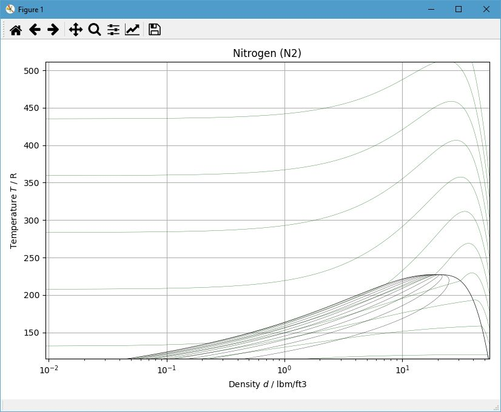

.. examples

Pure Fluids
===========

State Point
-----------

Create a listing of properties at a given T and D::
    
    from engcoolprop.ec_fluid import EC_Fluid
    
    # Print state point
    ec = EC_Fluid(symbol="N2", T=530.0,P=100.0 ) # T=degR, P=psia
    
    ec.setProps(T=500., D=0.1) # Set T and D

    ec.printProps() # Print state point at given T,P

Output::
    
    State Point for fluid Nitrogen (N2)
    T =     500  degR (Tc= 227.146 , Tnbp= 139.239 Ttriple= 113.672 )
    P = 19.1444  psia (Pc= 492.519 )
    D =     0.1  lbm/cu ft (Dc= 19.5587 )
    E = 88.3793  BTU/lbm
    H = 123.806  BTU/lbm
    S = 1.59617  BTU/lbm degR
    Cv=0.177465  BTU/lbm degR
    Cp=0.248873  BTU/lbm degR
    g = 1.40238  Cp/Cv (-)
    A =    1115  ft/sec
    V = 1.13254  viscosity [1.0E5 * lb/ft-sec]
    C =0.0140818  thermal conductivity [BTU/ft-hr-R]
    MW= 28.0135  lbm/lbmmole
    Q =      -1  Vapor Quality (mass fraction gas)
    Z =0.999722  (-)    

printSIUnits
------------

Although EngCoolProp was created to promote English units when using `CoolProp <http://www.coolprop.org/dev/index.html>`_ ,    
it is often helpful to see properties in SI units.

For that reason, all the EngCoolProp models have a method called **printSIUnits** that will output the State Point with SI units.
The script below shows the result of calling **printSIUnits**::

    from engcoolprop.ec_fluid import EC_Fluid
    ec = EC_Fluid(symbol="H2O", T=530.0,P=100.0 ) # T=degR, P=psia

    ec.printSIProps() # Print state point at given T,P with SI units

Output::

    State Point for fluid Water (H2O)
    T =    294.444  degK (Tc=647.096 , Tnbp=373.124 Ttriple=273.16 )
    P =     689476  Pa (Pc=2.2064e+07 )
    D =    998.199  kg/m^3 (Dc=322 )
    E =      89283  J/kg
    H =    89973.7  J/kg
    S =    314.765  J/kg/K
    Cv=    4149.79  J/kg/K
    Cp=    4181.41  J/kg/K
    g =    1.00762  Cp/Cv (-)
    A =    1487.23  m/s
    V =0.000970479  viscosity Pa-s
    C =   0.600621  thermal conductivity W/m/K
    MW=    18.0153  g/mol
    Q =         -1  Vapor Quality (mass fraction gas)
    Z = 0.00508403  (-)    

Critical Properties
-------------------

Create a listing of critical properties::

    from engcoolprop.ec_fluid import EC_Fluid

    ec = EC_Fluid(symbol="O2", T=530.0,P=100.0 ) # T=degR, P=psia

    ec.printCriticalProps() # Print critical properties

Output::

    Critical Properties for fluid Oxygen (O2)
    Tc= 278.246 degR
    Tnbp= 162.338 degR
    Pc = 731.425 psia
    Dc = 27.2276 lbm/cu ft
    MW= 31.9988  lbm/lbmmole
    Zc =0.287943  (-)
    Hc = 13.9393  BTU/lbm
    Ec = 8.96846  BTU/lbm
    Sc = 1.00335  BTU/lbm degR
    Ac = 502.502  ft/sec
    Vc =     nan  viscosity [1.0E5 * lb/ft-sec]
    Cc =0.0221309  thermal conductivity [BTU/ft-hr-R]

Table of Values
---------------

Create a table of properties::

    from engcoolprop.ec_fluid import EC_Fluid

    ec = EC_Fluid(symbol="AR")
    print('Properties for: %s (%s)'%(ec.name, ec.symbol) )
    for T in range(460, 570, 10):
        ec.setProps(T=T, P=14.7)
        ec.printTPD()

Output::

    Properties for: Argon (AR)
    AR T= 460.0 P=  14.7 D=0.1191 E= 34.21 H= 57.05 S=0.906 Q=-1.00
    AR T= 470.0 P=  14.7 D=0.1166 E= 34.96 H= 58.30 S=0.908 Q=-1.00
    AR T= 480.0 P=  14.7 D=0.1141 E= 35.71 H= 59.55 S=0.911 Q=-1.00
    AR T= 490.0 P=  14.7 D=0.1118 E= 36.46 H= 60.79 S=0.914 Q=-1.00
    AR T= 500.0 P=  14.7 D=0.1095 E= 37.21 H= 62.04 S=0.916 Q=-1.00
    AR T= 510.0 P=  14.7 D=0.1074 E= 37.95 H= 63.29 S=0.919 Q=-1.00
    AR T= 520.0 P=  14.7 D=0.1053 E= 38.70 H= 64.53 S=0.921 Q=-1.00
    AR T= 530.0 P=  14.7 D=0.1033 E= 39.45 H= 65.78 S=0.923 Q=-1.00
    AR T= 540.0 P=  14.7 D=0.1014 E= 40.20 H= 67.02 S=0.926 Q=-1.00
    AR T= 550.0 P=  14.7 D=0.0995 E= 40.94 H= 68.27 S=0.928 Q=-1.00
    AR T= 560.0 P=  14.7 D=0.0978 E= 41.69 H= 69.52 S=0.930 Q=-1.00

TD Plot
-------

Create a TD plot using CoolProp plotting routine::

    from CoolProp.Plots.Common import BasePlot, PropertyDict, BaseDimension
    from engcoolprop.ec_fluid import EC_Fluid

    symbol = 'N2'

    class ENGunits(PropertyDict):
        def __init__(self):
            self._D = BaseDimension(add_SI=0.0, mul_SI=1./16.01843417, off_SI=0.0, label='Density',       symbol=u'd', unit=u'lbm/ft3')
            self._H = BaseDimension(add_SI=0.0, mul_SI=0.000429923, off_SI=0.0, label='Specific Enthalpy',symbol=u'h', unit=u'BTU/lbm')
            self._P = BaseDimension(add_SI=0.0, mul_SI=1.0/6894.76, off_SI=0.0, label='Pressure',         symbol=u'p', unit=u'psia')
            self._S = BaseDimension(add_SI=0.0, mul_SI=0.0002388461,off_SI=0.0, label='Specific Entropy', symbol=u's', unit=u'BTU/lbm/R')
            self._T = BaseDimension(add_SI=0.0, mul_SI=1.8,         off_SI=0.0, label='Temperature',      symbol=u'T', unit=u'R')
            self._U = BaseDimension(add_SI=0.0, mul_SI=0.000429923, off_SI=0.0, label='Specific Internal Energy', symbol=u'u', unit=u'BTU/lbm')
            self._Q = BaseDimension(add_SI=0.0, mul_SI=1.0,         off_SI=0.0, label='Vapour Quality',   symbol=u'x', unit=u'')
            
    BasePlot.UNIT_SYSTEMS['ENG'] = ENGunits() # ['EUR','KSI','SI']

    ec = EC_Fluid(symbol)
    ec.printCriticalProps()

    # Plot Types: 'PS', 'PT', 'HS', 'TS', 'PD', 'TD', 'PH'
    # tp_limits:  'NONE', 'DEF','ACHP','ORC'
    plot = PropertyPlot(symbol, 'TD', unit_system='ENG', tp_limits='DEF')
    plot.calc_isolines(CP.iHmass, num=11)
    plot.calc_isolines(CP.iQ, num=11)
    plot.title('%s (%s)'%(ec.name, ec.symbol))
    plot.grid()
    plot.show()

And printed Output::

    Critical Properties for fluid Nitrogen (N2)
    Tc= 227.146 degR
    Tnbp= 139.239 degR
    Pc = 492.519 psia
    Dc = 19.5587 lbm/cu ft
    MW= 28.0135  lbm/lbmmole
    Zc =0.289458  (-)
    Hc = 12.5678  BTU/lbm
    Ec = 7.90791  BTU/lbm
    Sc = 1.00671  BTU/lbm degR
    Ac = 444.365  ft/sec
    Vc = 1.22997  viscosity [1.0E5 * lb/ft-sec]
    Cc = 886.461  thermal conductivity [BTU/ft-hr-R]
