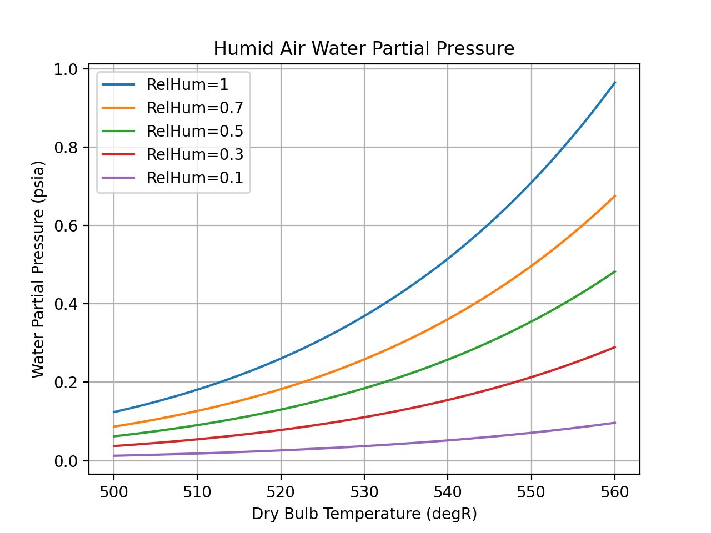

.. humid_air

Humid Air
=========

The `CoolProp <http://www.coolprop.org/dev/index.html>`_ project not only supports 
`Pure Fluids <http://www.coolprop.org/fluid_properties/PurePseudoPure.html#list-of-fluids>`_
wrapped by the EngCoolProp **EC_Fluid** object
:ref:`link_ec_fluid_functions`, 
but also  `Humid Air <http://www.coolprop.org/fluid_properties/HumidAir.html>`_
wrapped by the EngCoolProp **EC_Humid_Air** object
:ref:`link_ec_humid_air_functions`.

The most simple way to create an **EC_Humid_Air** object is::

    from engcoolprop.ec_humid_air import EC_Humid_Air
    HA = EC_Humid_Air()

However, the object can be initialized in a number of ways that all result in the required
three inputs to the CoolProp HAPropsSI interface. 
(see resulting inputs as comment after EC_Humid_Air initialization call)::

    *) Can initialize with no input parameters
    EC_Humid_Air() # T=536.4, P=14.6959, RelHum=0.5

    *) Can omit pressure (P) and 1 atm will be assumed
    EC_Humid_Air(T=600, R=1) # T=600, R=1, P=14.6959

    *) Can append "degF" to any temperature and degR will result
    EC_Humid_Air(TdegF=70, RelHum=.6) # T=529.67, RelHum=0.6, P=14.6959

    *) Can use all synonyms for inputs (e.g. T_db, Tdb, T)
    EC_Humid_Air(P=14.7, RH=.3, Tdb=530) # P=14.7, RH=0.3, Tdb=530

Input Parameters
----------------

To see the legal input parameters for EC_Humid_Air, run the following script::

    from engcoolprop.ec_humid_air import EC_Humid_Air
    ha = EC_Humid_Air()
    ha.print_input_params()

with results::

   +----------------------------------------------------------------------------+
   |  ---------------------- Humid Air Input Parameters ----------------------  |
   +----------------------------------------------------------------------------+
       Tdb                    degR Dry-Bulb Temperature               ::AKA {'T_db', 'T'}
   WetBulb                    degR Wet-Bulb Temperature               ::AKA {'B', 'Twb', 'T_wb'}
  DewPoint                    degR Dew-Point Temperature              ::AKA {'T_dp', 'Tdp', 'D'}
         P                    psia Pressure
       P_w                    psia Partial pressure of water vapor
       Vda        ft^3/lbm dry air Mixture volume per unit dry air    ::AKA {'V'}
       Vha      ft^3/lbm humid air Mixture volume per unit humid air
       Hda         BTU/lbm dry air Mixture enthalpy per dry air       ::AKA {'H', 'Enthalpy'}
       Hha       BTU/lbm humid air Mixture enthalpy per humid air
       Sda    BTU/lbm dry air/degR Mixture entropy per unit dry air   ::AKA {'Entropy', 'S'}
       Sha  BTU/lbm humid air/degR Mixture entropy per unit humid air
    RelHum                         Relative humidity in range [0, 1]  ::AKA {'RH', 'R'}
    HumRat   lbm water/lbm dry air Humidity Ratio                     ::AKA {'W', 'Omega'}
         Y mol water/mol humid air Water mole fraction                ::AKA {'psi_w'}

Note that Pressure(P) must ALWAYS be input and that for the remaining 2 inputs,
not all input pairs are compatible. 
Dry bulb temperature(Tdb) will work with ALL other input parameters, however,
the rest of the input parameters are more limited.
The following shows what pairs are known to work and fail::

       Tdb WORKS: DewPoint, Hda, Hha, HumRat, P_w, RelHum, Sda, Sha, Vda, Vha, WetBulb, Y
           FAILS:

    RelHum WORKS: Hda, Hha, P_w, Sda, Sha, Tdb, Vda, Vha, WetBulb, Y
           FAILS: DewPoint, HumRat

  DewPoint WORKS: Hda, Hha, Sda, Sha, Tdb, Vda, Vha, WetBulb
           FAILS: HumRat, P_w, RelHum, Y

    HumRat WORKS: Hda, Hha, Sda, Sha, Tdb, Vda, Vha, WetBulb
           FAILS: DewPoint, P_w, RelHum, Y

       Hda WORKS: DewPoint, HumRat, RelHum, Tdb
           FAILS: Hha, P_w, Sda, Sha, Vda, Vha, WetBulb, Y

       Hha WORKS: DewPoint, HumRat, RelHum, Tdb
           FAILS: Hda, P_w, Sda, Sha, Vda, Vha, WetBulb, Y

       Sda WORKS: DewPoint, HumRat, RelHum, Tdb
           FAILS: Hda, Hha, P_w, Sha, Vda, Vha, WetBulb, Y

       Sha WORKS: DewPoint, HumRat, RelHum, Tdb
           FAILS: Hda, Hha, P_w, Sda, Vda, Vha, WetBulb, Y

       Vda WORKS: DewPoint, HumRat, RelHum, Tdb
           FAILS: Hda, Hha, P_w, Sda, Sha, Vha, WetBulb, Y

       Vha WORKS: DewPoint, HumRat, RelHum, Tdb
           FAILS: Hda, Hha, P_w, Sda, Sha, Vda, WetBulb, Y

   WetBulb WORKS: DewPoint, HumRat, RelHum, Tdb
           FAILS: Hda, Hha, P_w, Sda, Sha, Vda, Vha, Y

       P_w WORKS: RelHum, Tdb
           FAILS: DewPoint, Hda, Hha, HumRat, Sda, Sha, Vda, Vha, WetBulb, Y

         Y WORKS: RelHum, Tdb
           FAILS: DewPoint, Hda, Hha, HumRat, P_w, Sda, Sha, Vda, Vha, WetBulb

Output Parameters
-----------------

To see all output parameters, run the following script::

    from engcoolprop.ec_humid_air import EC_Humid_Air
    ha = EC_Humid_Air()
    ha.print_output_params()

with results::

   +-----------------------------------------------------------------------------+
   |  ---------------------- Humid Air Output Parameters ----------------------  |
   +-----------------------------------------------------------------------------+
       Tdb                    degR Dry-Bulb Temperature               ::AKA {'T_db', 'T'}
   WetBulb                    degR Wet-Bulb Temperature               ::AKA {'B', 'Twb', 'T_wb'}
  DewPoint                    degR Dew-Point Temperature              ::AKA {'T_dp', 'Tdp', 'D'}
         P                    psia Pressure
       P_w                    psia Partial pressure of water vapor
       Vda        ft^3/lbm dry air Mixture volume per unit dry air    ::AKA {'V'}
       Vha      ft^3/lbm humid air Mixture volume per unit humid air
        cp    BTU/lbm dry air/degR Mixture Cp per unit dry air        ::AKA {'C'}
     cp_ha  BTU/lbm humid air/degR Mixture Cp per unit humid air      ::AKA {'Cha'}
        CV    BTU/lbm dry air/degR Mixture Cv per unit dry air
      CVha  BTU/lbm humid air/degR Mixture Cv per unit humid air      ::AKA {'cv_ha'}
       Hda         BTU/lbm dry air Mixture enthalpy per dry air       ::AKA {'H', 'Enthalpy'}
       Hha       BTU/lbm humid air Mixture enthalpy per humid air
       Sda    BTU/lbm dry air/degR Mixture entropy per unit dry air   ::AKA {'Entropy', 'S'}
       Sha  BTU/lbm humid air/degR Mixture entropy per unit humid air
      Cond             BTU/ft-hr-R Mixture thermal conductivity       ::AKA {'Conductivity', 'K', 'k'}
      Visc    [1.0E5 * lbm/ft-sec] Mixture viscosity                  ::AKA {'mu', 'M'}
    RelHum                         Relative humidity in range [0, 1]  ::AKA {'RH', 'R'}
    HumRat   lbm water/lbm dry air Humidity Ratio                     ::AKA {'W', 'Omega'}
         Y mol water/mol humid air Water mole fraction                ::AKA {'psi_w'}
         Z                         Compressibility factor (Z=pv/(RT))

State Point
-----------

Creating a listing of properties at a given state point is done by calling **printProps()**::

    from engcoolprop.ec_humid_air import EC_Humid_Air
    ha = EC_Humid_Air()
    ha.printProps()

Resulting In::

   +------------------------------------------------------------------------+
   |  ---- State Point for Humid Air (T=536.4, P=14.6959, RelHum=0.5) ----  |
   +------------------------------------------------------------------------+
       Tdb =       536.4 degR  :: Dry-Bulb Temperature (76.7 degF)
   WetBulb =     523.638 degR  :: Wet-Bulb Temperature (64.0 degF)
  DewPoint =     516.383 degR  :: Dew-Point Temperature (56.7 degF)
         P =     14.6959 psia  :: Pressure (1 atm)
       P_w =    0.228794 psia  :: Partial pressure of water vapor (0.0155686 atm)

       Vda =     13.7316 ft^3/lbm dry air  :: Mixture volume per unit dry air
       Vha =     13.5978 ft^3/lbm humid air  :: Mixture volume per unit humid air

        cp =    0.244776 BTU/lbm dry air/degR  :: Mixture Cp per unit dry air
     cp_ha =    0.242391 BTU/lbm humid air/degR  :: Mixture Cp per unit humid air
        CV =    0.174785 BTU/lbm dry air/degR  :: Mixture Cv per unit dry air
      CVha =    0.173083 BTU/lbm humid air/degR  :: Mixture Cv per unit humid air

       Hda =     21.5138 BTU/lbm dry air  :: Mixture enthalpy per dry air
       Hha =     21.3042 BTU/lbm humid air  :: Mixture enthalpy per humid air
       Sda =   0.0428596 BTU/lbm dry air/degR  :: Mixture entropy per unit dry air
       Sha =   0.0424422 BTU/lbm humid air/degR  :: Mixture entropy per unit humid air

      Cond =   0.0151596 BTU/ft-hr-R  :: Mixture thermal conductivity
      Visc =     1.23324 [1.0E5 * lbm/ft-sec]  :: Mixture viscosity

    RelHum =         0.5   :: Relative humidity in range [0, 1]
    HumRat =  0.00983592 lbm water/lbm dry air  :: Humidity Ratio
         Y =   0.0155686 mol water/mol humid air  :: Water mole fraction
         Z =    0.999629   :: Compressibility factor (Z=pv/(RT))

Note that:: 
    
    ha.printProps( eng_units=False )

will output SI units.::

   +---------------------------------------------------------------------+
   |  ---- State Point for Humid Air (T=298, P=101325, RelHum=0.5) ----  |
   +---------------------------------------------------------------------+
       Tdb =         298 K  :: Dry-Bulb Temperature
   WetBulb =      290.91 K  :: Wet-Bulb Temperature
  DewPoint =     286.879 K  :: Dew-Point Temperature
         P =      101325 Pa  :: Pressure
       P_w =     1577.48 Pa  :: Partial pressure of water vapor

       Vda =    0.857236 m^3 /kg dry air  :: Mixture volume per unit dry air
       Vha =    0.848887 m^3 /kg humid air  :: Mixture volume per unit humid air

        cp =     1024.83 J/kg dry air/K  :: Mixture Cp per unit dry air
     cp_ha =     1014.84 J/kg humid air/K  :: Mixture Cp per unit humid air
        CV =     731.789 J/kg dry air/K  :: Mixture Cv per unit dry air
      CVha =     724.661 J/kg humid air/K  :: Mixture Cv per unit humid air

       Hda =     50041.1 J/kg dry air  :: Mixture enthalpy per dry air
       Hha =     49553.7 J/kg humid air  :: Mixture enthalpy per humid air
       Sda =     179.445 J/kg dry air/K  :: Mixture entropy per unit dry air
       Sha =     177.697 J/kg humid air/K  :: Mixture entropy per unit humid air

      Cond =   0.0262197 W/m/K  :: Mixture thermal conductivity
      Visc = 1.83527e-05 Pa-s  :: Mixture viscosity

    RelHum =         0.5   :: Relative humidity in range [0, 1]
    HumRat =  0.00983592 kg water/kg dry air  :: Humidity Ratio
         Y =   0.0155686 mol water/mol humid air  :: Water mole fraction
         Z =    0.999629   :: Compressibility factor (Z=pv/(RT))    

Making Plots
------------

An easy way to make plots is to use the `matplotlib <https://matplotlib.org/>`_ package.

To install `matplotlib <https://matplotlib.org/>`_ give the commands::
    
    pip install matplotlib    
       ... OR to upgrade...
    pip install --upgrade matplotlib

The example below will plot the partial pressure of water vapor (P_w) over a range of states.::

    import matplotlib.pyplot as plt
    from engcoolprop.ec_humid_air import EC_Humid_Air

    HA = EC_Humid_Air()

    for RelHum in [1.0, 0.7, 0.5, 0.3, 0.1]:

        tL = [500 + i for i in range(61)]
        hL = []
        for T in tL:
            HA.setProps( Tdb=T, RelHum=RelHum)
            hL.append( HA.P_w )

        plt.plot( tL, hL, label='RelHum=%g'%RelHum)
    plt.grid( True )
    plt.title( 'Humid Air Water Partial Pressure')
    plt.xlabel( 'Dry Bulb Temperature (degR)')
    plt.ylabel( 'Water Partial Pressure (psia)')
    plt.legend( loc='best' )

    plt.savefig( 'water_partial_pressure.png', dpi=200)
    plt.show()

