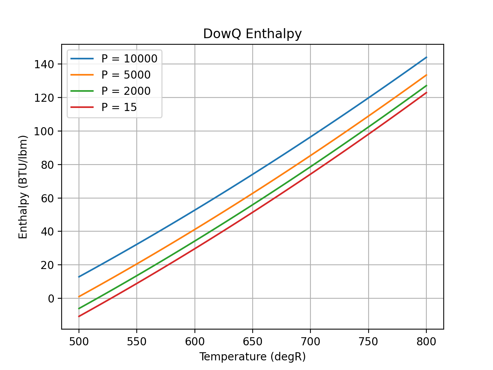

.. incompressible

Incompressible Fluids
=====================

The `CoolProp <http://www.coolprop.org/dev/index.html>`_ project not only supports 
`Pure Fluids <http://www.coolprop.org/fluid_properties/PurePseudoPure.html#list-of-fluids>`_
wrapped by the EngCoolProp **EC_Fluid** object
:ref:`link_ec_fluid_functions`, 
but also  `Incompressible Fluids <http://www.coolprop.org/fluid_properties/Incompressibles.html#pure>`_
wrapped by the EngCoolProp **EC_Incomp_Fluid** object
:ref:`link_ec_incomp_fluid_functions`.

To see a list of all incompressible fluids execute the following script::

    from CoolProp import __incompressibles_pure__
    print( __incompressibles_pure__ ) 

In March 2025, results in the list: **['Acetone', 'Air', 'AS10', 'AS20', 'AS30', 'AS40', 'AS55', 'DEB', 'DowJ', 
'DowJ2', 'DowQ', 'DowQ2', 'DSF', 'Ethanol', 'ExampleDigitalPure', 'ExamplePure', 'FoodAsh', 
'FoodCarbohydrate', 'FoodFat', 'FoodFiber', 'FoodIce', 'FoodProtein', 'FoodWater', 'HC10', 
'HC20', 'HC30', 'HC40', 'HC50', 'HCB', 'HCM', 'Hexane', 'HFE', 'HFE2', 'HY20', 'HY30', 'HY40', 
'HY45', 'HY50', 'LiqNa', 'NaK', 'NBS', 'PBB', 'PCL', 'PCR', 'PGLT', 'PHE', 'PHR', 'PLR', 'PMR',
'PMS1', 'PMS2', 'PNF', 'PNF2', 'S800', 'SAB', 'T66', 'T72', 'TCO', 'TD12', 'TVP1', 'TVP1869', 
'TX22', 'TY10', 'TY15', 'TY20', 'TY24', 'Water', 'XLT', 'XLT2', 'ZS10', 'ZS25', 'ZS40', 'ZS45', 'ZS55']**

For incompressible fluids, EngCoolProp uses units of primarily inch, lbm, lbf, sec, BTU (some use of ft and hour).::

    The following are the default units for each property.

    T    = Temperature = degR
    Tsat = Saturation Temperature (T if P==Psat) = degR
    Tnbp = Normal Boiling Point = degR
    P    = Pressure = psia
    Psat = Saturation Pressure (Vapor Pressure at T) = psia
    D    = Density = lbm/cu ft
    rho  = Density = lbm/cu inch
    E    = Internal Energy = BTU/lbm
    H    = Enthalpy = BTU/lbm
    S    = Entropy = BTU/lbm degR
    Cp   = Heat Capacity (const. P) = BTU/lbm degR
    V    = Viscosity = 1.0E5 * lb/ft-sec
    C    = Thermal Conductivity = BTU/ft-hr-R

Default State Point
-------------------

Create a listing of properties at the default state point.
(i.e. T=(Tmax+Tmin)/2, P=Pmax/10)::
    
    from engcoolprop.ec_incomp_fluid import EC_Incomp_Fluid

    # Create incompressible object. (without specifying state point)
    ec_inc = EC_Incomp_Fluid(symbol="Water", auto_fix_value_errors=True, show_warnings=2 )

    # Print state point
    ec_inc.printProps() # Print state point at given T,P

Output::

    +----------------------------------------------------------------+
    |     NOTICE: any input violations on limits of T, D, H or S     |
    |      will be automatically corrected (set to min or max).      |
    |  To change this behavior set "auto_fix_value_errors" to False  |
    |     To suppress this banner set "show_warnings" to 0 or 1      |
    +----------------------------------------------------------------+
    State Point for fluid INCOMP::Water (Water)
    T =      671  degR,                              Range(  491.67 -   851.67) degR
    P =     1000  psia                               Range(       0 -    10000) psia
    D =   60.043  lbm/cuft                           Range( 54.2479 -  62.6328) lbm/cuft
    E =  142.121  BTU/lbm                            Range(-36.7331 -  328.172) BTU/lbm
    H =  145.203  BTU/lbm                            Range(-35.9312 -  342.116) BTU/lbm
    S = 0.238477  BTU/lbm degR                       Range(-0.072072 - 0.483928) BTU/lbm degR
    Cp=  1.00285  BTU/lbm degR                       Range(0.999244 -  1.06583) BTU/lbm degR
    V =  19.0492  viscosity [1.0E5 * lbm/ft-sec]     Range( 9.17101 -  118.181)
    C = 0.393587  thermal conductivity [BTU/ft-hr-R] Range(0.324617 -   0.3845)
        Tnbp =  671.707  degR,
        rho  =0.0347471  lbm/cuin                    Range(0.031393 - 0.036246) lbm/cuin
        Psat =  14.4914  psia                        Range(0 - 226.073) psia

Can also print short forms of properties as::

    ec_inc.printTPD()
    
    ec_inc.printTransport()

Output::    

    INCOMP::Water T= 671.0 P=1000.0 D=60.0430 E=142.12 H=145.20 S=0.238
    INCOMP::Water Cp=1.00285 Visc=19.0492 ThCond=0.393587

State Point
-----------

Create a listing of properties at a given T and P. Note that Pmax is specified.

Pmax is the highest pressure considered in any iterative calcs. 
The default value for Pmax is 10,000 psia(see Range of P above).
It is usually best to keep Pmax above the max pressure being analyzed.::

    # Create incompressible object at T=500 degR, P=500 psia and max pressure = 5000 psia
    ec_inc = EC_Incomp_Fluid(symbol="Water", T=500, P=500, Pmax=5000) # T=degR, P=psia

    # OR... After ec_inc has been crated
    ec_inc.setTP( 500, 500)

    # Print state point
    ec_inc.printProps()

Output::

    State Point for fluid INCOMP::Water (Water)
    T =       500  degR,                              Range(  491.67 -   851.67) degR
    P =       500  psia                               Range(       0 -     5000) psia
    D =   62.6007  lbm/cuft                           Range( 54.2479 -  62.6328) lbm/cuft
    E =  -27.7038  BTU/lbm                            Range( -36.353 -  328.172) BTU/lbm
    H =  -26.2257  BTU/lbm                            Range(-35.9729 -  335.377) BTU/lbm
    S =-0.0538473  BTU/lbm degR                       Range(-0.071299 - 0.483928) BTU/lbm degR
    Cp=   0.99868  BTU/lbm degR                       Range(0.999244 -  1.06583) BTU/lbm degR
    V =   102.357  viscosity [1.0E5 * lbm/ft-sec]     Range( 9.17101 -  118.181)
    C =  0.330189  thermal conductivity [BTU/ft-hr-R] Range(0.324617 -   0.3845)
        Tnbp =   671.707  degR,
        rho  = 0.0362273  lbm/cuin                    Range(0.031393 - 0.036246) lbm/cuin
        Psat =         0  psia                        Range(0 - 226.073) psia

Acetone State Point
-------------------

The above examples were for Water that has saturation properties included in CoolProp.
Acetone does not have saturation properties.
An example with Acetone looks as follows::

    from engcoolprop.ec_incomp_fluid import EC_Incomp_Fluid

    # Create incompressible object. (without specifying state point)
    ec_inc = EC_Incomp_Fluid(symbol="Acetone" )

    # Print state point
    ec_inc.printProps()

As before, the default state point is T=(Tmax+Tmin)/2, P=Pmax/10

Output::

    State Point for fluid INCOMP::Acetone (Acetone)
    T =      553  degR,                              Range(  356.67 -  749.665) degR
    P =     1000  psia                               Range(       0 -    10000) psia
    D =   48.427  lbm/cuft                           Range( 39.3847 -  55.7377) lbm/cuft
    E =  11.2384  BTU/lbm                            Range(-91.8912 -  123.564) BTU/lbm
    H =  15.0596  BTU/lbm                            Range(-83.7831 -  123.564) BTU/lbm
    S =0.0209767  BTU/lbm degR                       Range(-0.214127 - 0.194387) BTU/lbm degR
    Cp= 0.516159  BTU/lbm degR                       Range(0.476931 - 0.623845) BTU/lbm degR
    V =  23.0543  viscosity [1.0E5 * lbm/ft-sec]     Range( 12.4036 -  113.822)
    C =        0  thermal conductivity [BTU/ft-hr-R] Range(       0 -        0)
        rho  =0.0280249  lbm/cuin                    Range(0.022792 - 0.032256) lbm/cuin

Making Plots
------------

An easy way to make plots is to use the `matplotlib <https://matplotlib.org/>`_ package.

To install `matplotlib <https://matplotlib.org/>`_ give the commands::
    
    pip install matplotlib    
       ... OR to upgrade...
    pip install --upgrade matplotlib

The example below will plot the enthalpy (H) of DowQ as a function of temperature and pressure.::

    import matplotlib.pyplot as plt
    import numpy as np
    from engcoolprop.ec_incomp_fluid import EC_Incomp_Fluid

    # Create incompressible solution object. (without specifying state point)
    ec_inc = EC_Incomp_Fluid(symbol="DowQ", auto_fix_value_errors=True, show_warnings=0 ) # T=degR, P=psia

    tArr = np.linspace(500, 800, 50)

    # Use a few different pressures
    for P in [10000, 5000, 2000, 15]:

        densL = []
        for T in tArr:
            ec_inc.setTP( T, P)
            densL.append( ec_inc.H )

        plt.plot( tArr, densL, label="P = %g"%P)

    plt.grid( True )
    plt.title( 'DowQ Enthalpy')
    plt.xlabel( 'Temperature (degR)')
    plt.ylabel( 'Enthalpy (BTU/lbm)')
    plt.legend( loc='best' )

    plt.savefig( 'DowQ_enthalpy.png', dpi=200)
    plt.show()

